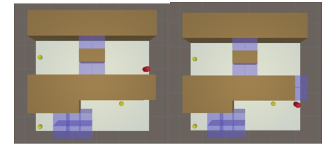

# Mega_Maze
Mega_Maze is a advance version of the popular maze.
In this game you can destroy  walls by 2 kinds of bombs & you have limitation in usage of the bombs
also there is some blue wall that let u move throw them one time and change to hard walls(brown wall)
targe is achiving the yellow goals

## problem
In casual games needs make infinite levels for users and in this problem by instantiating random walls and goals in map we can make alot of levels
But there is no Certainty about solvability of levels.
There for we use Reinforcement Learning(RL) to solve levels before users can play them. At the end only levels that solved by RL can deploy in game for all users

